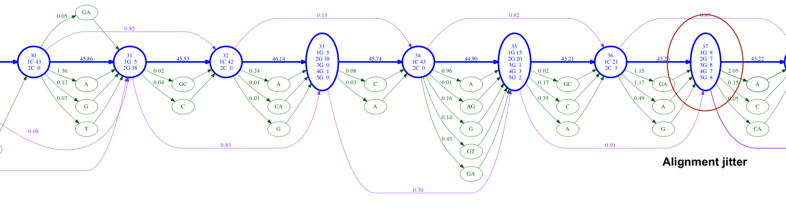
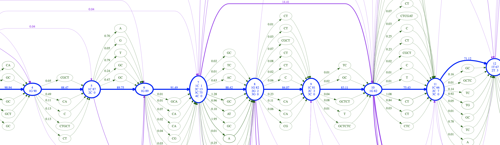

## MarginPolish-HELEN Release notes  (March-2020)
We have improved the internal algorithm and deployment modes of our  RLE-based nanopore assembly. In this document we address some highlights.

#### 1. Introducing RLE based alignment
One of the issues with `MarginPolish` was disregarding the run-length count during pairwise read alignment. This caused some minor jitters in the alignment. For example, in the following POA graph, you can see that node 37 has weights almost equally distributed among observations of Gs with 5 different run-lengths. The neural network would almost certainly make a wrong call on node 37. These cases were uncommon but was causing some issues in large scale genomes.
<p align="center">

</p>

The newest version of `MarginPolish` uses the RLE counts during alignment which ensures proper alignment in Run-length encoded mode. Following is another repeat region where we don't see the jitter anymore due to the fix in the alignment parameters. We have extensively tested the applicability of the new alignment model and the results are satisfactory.
<p align="center">

</p>

#### 2. Accelerated CPU based inference with HELEN
<p align="center">

</p>

The new version of `HELEN` uses `ONNX-RUNTIME` to provide accelerated inference on CPU-only machines. Our internal tests show that the inference step of `HELEN` takes `1~2 mins` on microbial genomes ad `6-8 hours` on a human-scale genome. We are seeing `8x` speed improvement with `HELEN`.

#### 3. Distributed GPU inference
<p align="center">

</p>

If you own a multi-GPU computer, `HELEN` can utilize all of the available GPUs by default. On a 8-GPU machine, a human-scale genome takes `~50mins` for inference. It was `~4 hours` in our initial release.

#### 4. Simplified installation and user-experience
<p align="center">

</p>

We have improved the installation methods for `MarginPolish-HELEN`. Now the installation of `HELEN` also installs `MarginPolish`. It is available through `pip` and other methods. It is as simple as:
```bash
git clone https://github.com/kishwarshafin/helen.git
cd helen
make install
. ./venv/bin/activate

helen --help
marginpolish --help
```

#### 5. MarginPolish-HELEN outperforms Racon-Medaka.
