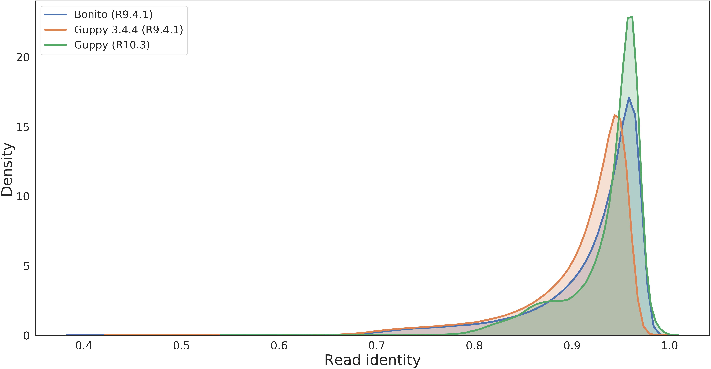
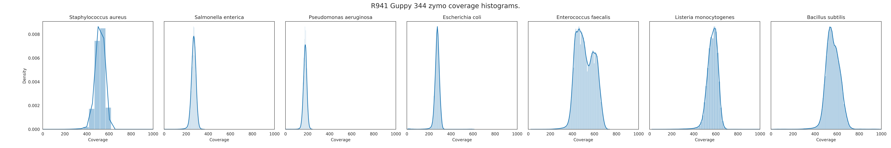
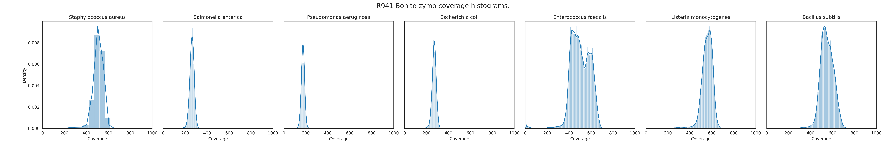
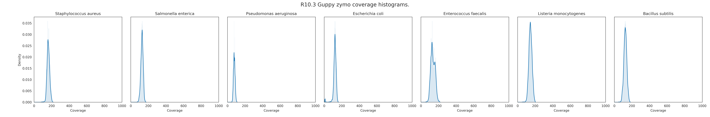
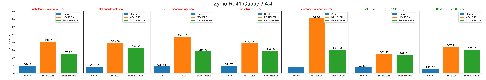
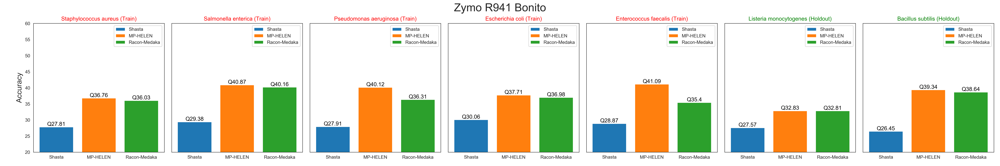
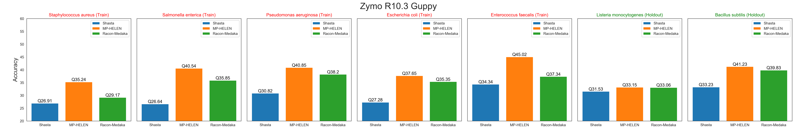
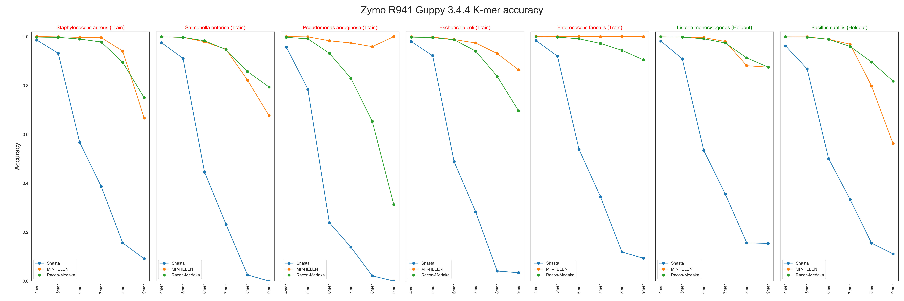
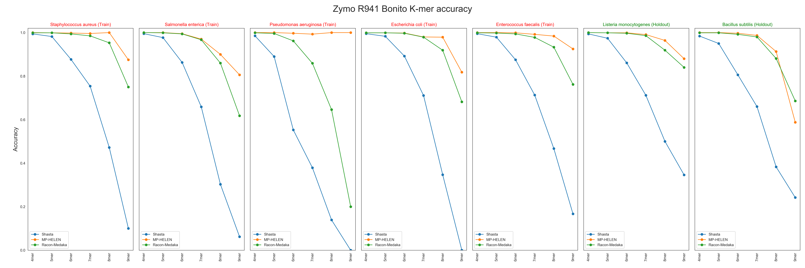

## Assembly and polishing of Zymo microbial community.
In this experiment, we show that `MarginPolish-HELEN` can effectively polish microbial genomes and achieve higher accuracy than existing `Racon-Medaka` pipeline. We make sure that all the results are **reproducible** and we trained the probabilistic models with properly **held-out** sets to ensure generalizability of the models. Most of the reported models of `Medaka` do not report train-validation split which makes it difficult to evaluate the pipeline to ensure generalizability.

We are releasing four `MP-HELEN` models to polish Microbial genomes:
* HELEN_r941_guppy344_microbial
* HELEN_r941_bonito_microbial
* HELEN_r10_3_guppy_microbial
* MP_r941_guppy344_microbial
* MP_r941_bonito_microbial
* MP_r10_3_guppy_microbial

You can download the models by running:
```bash
helen download_models \
--output_dir </Path/to/output_dir>
```

### Experimental Setup
To evaluate the pipeline we used three datasets which are publicly available:
* [R10.3 Zymo dataset basecalled with Guppy](https://storage.googleapis.com/kishwar-helen/polished_genomes/Zymo_experiment/Zymo_reads/R10.3_Zymo_Guppy_reads.fastq)
* [R9.4.1 Zymo dataset basecalled with Guppy 3.4.4](https://storage.googleapis.com/kishwar-helen/polished_genomes/Zymo_experiment/Zymo_reads/R941_Zymo_Guppy_344_reads.fastq)
* [R9.4.1 Zymo dataset basecalled with Bonito](https://storage.googleapis.com/kishwar-helen/polished_genomes/Zymo_experiment/Zymo_reads/R941_Zymo_Bonito_reads.fastq)

Note: We used the R10.3 dataset from [here](https://lomanlab.github.io/mockcommunity/r10.html). The basecaller name and version for this data is not listed so we do not list the specific Guppy version for this dataset.

We used the Zymo reference to evaluate the outputs of each step. The reference is also publicly available:
* [Zymo reference](https://storage.googleapis.com/kishwar-helen/polished_genomes/Zymo_experiment/Zymo_reference/Zymo_reference.fasta)

We used seven microbial samples to carry out the experiment.
* *Staphylococcus aureus*
* *Salmonella enterica*
* *Pseudomonas aeruginosa*
* *Escherichia coli*
* *Enterococcus faecalis*
* *Listeria monocytogenes*
* *Bacillus subtilis*

We used [https://github.com/jts/assembly_accuracy](https://github.com/jts/assembly_accuracy) to assess each of the assemblies.
```bash
python3 fastmer.py \
--min-mapping-quality 10 \
--reference <reference.fasta> \
--assembly <assembly.fasta>
```
### Basecaller comparison

We compared all three datasets to evaluate the basecallers.
<p align="center">

</p>

From the read identity plot, it's clear that R10.3 has the best set of reads. For R9.4.1 we get best reads with Bonito and then Guppy 3.4.4. It's surprising that Bonito is now producing better reads for Zymo data. Although, not being able to utilize multiple-GPUs and not having a quality score make it difficult to utilize the Bonito reads properly as `MarginPolish` uses the base qualities extensively.

### Coverage comparison
Then we look at the coverage of each of the dataset for all seven species.
<p align="center">

</p>
<p align="center">

</p>
The coverage of R9.4.1 is very high and consistent between two basecallers as it's the same dataset basecalled with two different basecallers. <br/>
<p align="center">

</p>
The coverage of R10.3 data is on the lower end, but the quality of this dataset is higer than R9.4.1. We expect the assembly qualities to be better.

### Q-value comparison
We polished each of the genomes with `MarginPolish-HELEN` and `Racon-Medaka`. We used the [assembly_accuracy](https://github.com/jts/assembly_accuracy) tool to evaluate each of the assemblies.
<p align="center">

</p>

The Guppy 3.4.4 assemblies are polished with `r941_min_high_g344` model available with `Medaka`. There are no specific notes saying if there were any hold-outs while training this model. We see that `MargiPolish-HELEN` achieves higher accuracy than `Racon-Medaka` on both holdout sets. Although `MargiPolish-HELEN` achieves Q55 on one of the genomes in the training set. We want to **strongly underline** that it's a clear case of overfitting. The model doesn't achieve same result on the holdout set. This also shows the importance of demonstrating train-validation split when reporting a deep neural network model.

<p align="center">

</p>

We used the model reported on [Bonito's gihub page](https://nanoporetech.box.com/shared/static/oukeesfjc6406t5po0x2hlw97lnelkyl.hdf5). This model reports that the last two genomes were held-out from training. Hence, we can assume that the comparison is fair. In this case also, `MarginPolish-HELEN` achieves higher accuracy than  `Racon-Medaka`. And between `Bonito` and `Guppy 3.4.4` we see better assemblies with `Bonito` as the read quality is higher with `Bonito`.
<p align="center">

</p>

We used `r10_min_high_g303` to run `Medaka`. Although we have a lower coverage for this dataset it provides the best polished assemblies. We think higher coverage of this dataset will help us achieve mean Q50.

### Homopolymer accuracy comparison
<p align="center">

</p>
<p align="center">

</p>
<p align="center">

</p>

The homopolymer accuracy plot shows that the polishing improves the overall accuracy of each homopolymer category from the draft assembly. The R9.4.1 Guppy 3.4.4 and R10.3 Guppy models do not report any hold-out set, so the comparison is difficult. We see that with Guppy R10.3 the long run-length accuracy of `MarginPolish-HELEN` is higher than `Racon-Medaka`.

### Data availability
The Shasta assemblies:
* [R9.4.1 Zymo Guppy 3.4.4 Shasta assemblies](https://storage.googleapis.com/kishwar-helen/polished_genomes/Zymo_experiment/Shasta_assemblies/R941_Zymo_Guppy_344_Shasta_assembly.fasta)
* [R9.4.1 Zymo Bonito Shasta assemblies](https://storage.googleapis.com/kishwar-helen/polished_genomes/Zymo_experiment/Shasta_assemblies/R941_Zymo_Bonito_Shasta_assembly.fasta)
* [R10.3 Zymo Guppy Shasta assemblies.](https://storage.googleapis.com/kishwar-helen/polished_genomes/Zymo_experiment/Shasta_assemblies/R10.3_Zymo_Guppy_Shasta_assembly.fasta)

The `Racon-Medaka` polished assemblies:
* [R9.4.1 Zymo Guppy 3.4.4 Shasta-Racon-Medaka assemblies](https://storage.googleapis.com/kishwar-helen/polished_genomes/Zymo_experiment/Medaka_polished_assemblies/Zymo_R941_guppy344_shasta_racon_medaka.fasta)
* [R9.4.1 Zymo Bonito Shasta-Racon-Medaka assemblies](https://storage.googleapis.com/kishwar-helen/polished_genomes/Zymo_experiment/Medaka_polished_assemblies/Zymo_R941_bonito_shasta_racon_medaka.fasta)
* [R10.3 Zymo Guppy Shasta-Racon-Medaka assemblies.](https://storage.googleapis.com/kishwar-helen/polished_genomes/Zymo_experiment/Medaka_polished_assemblies/Zymo_R10.3_guppy303_shasta_racon_medaka.fasta)

The `MarginPolish-HELEN` polished assemblies:
* [R9.4.1 Zymo Guppy 3.4.4 Shasta-MarginPolish-HELEN assemblies](https://storage.googleapis.com/kishwar-helen/polished_genomes/Zymo_experiment/HELEN_polished_assemblies/Zymo_R941_guppy344_shasta_mp_helen.fasta)
* [R9.4.1 Zymo Bonito Shasta-MarginPolish-HELEN assemblies](https://storage.googleapis.com/kishwar-helen/polished_genomes/Zymo_experiment/HELEN_polished_assemblies/Zymo_R941_Bonito_shasta_mp_helen.fasta)
* [R10.3 Zymo Guppy Shasta-MarginPolish-HELEN assemblies.](https://storage.googleapis.com/kishwar-helen/polished_genomes/Zymo_experiment/HELEN_polished_assemblies/Zymo_R10.3_Guppy_shasta_mp_helen.fasta)
